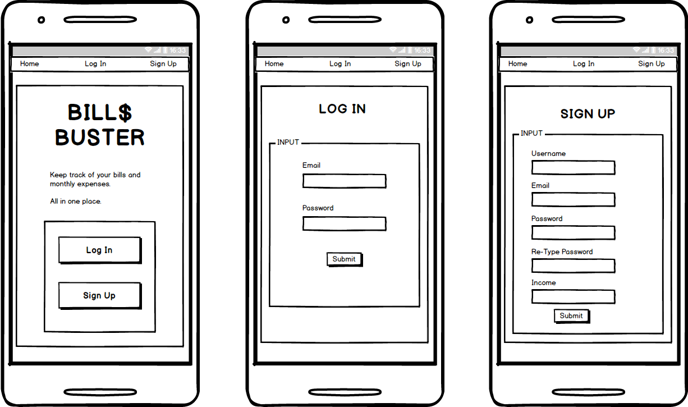
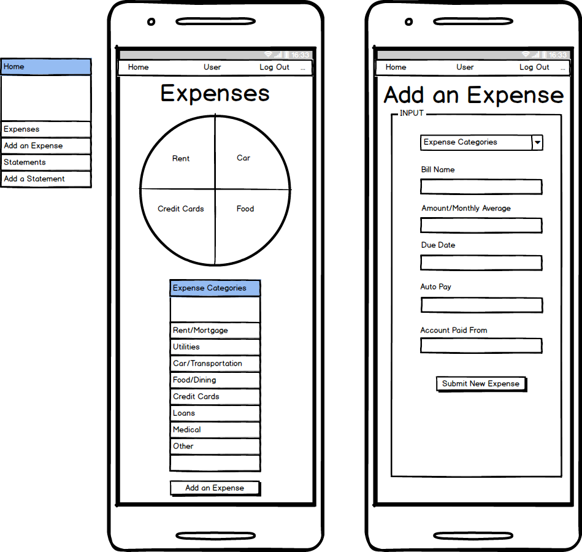
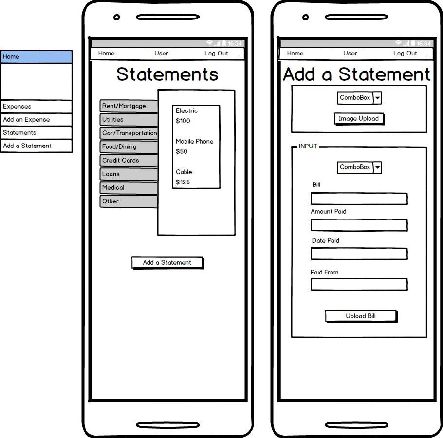

# BillsBuster

BillsBuster is a mobile responsive app that allows users to keep track of their total monthly amount of money spent on bills, while comparing it alongside their income.

### Dependencies

The app includes the following packages:

* Axios
* Body-Parser
* Express
* MySQL
* Sequelize
* Sequelize-Cli
* Nodemon
* Yarn
* React

### Usage

After registering with a **username/email** and password, users can track how much of their money they are spending on bills each month by filling out their billing information. This will help generate a graph that displays each's bill type's average expenditure compared to their monthly. BillsBuster is designed to make managing your finances simpler and more comprehensive, while allowing you to store all your bills virtually.

### Technologies

BillsBuster uses GET and POST routes to handle its data, along with a MySQL database using a Sequelize ORM. The app display is designed with Ionic and Bootstrap frameworks.

### Developers

* John Waymire
* Lina Kichen
* Ryan McKenzie

### Components and Tasks
- Database setup, login and signup pages, user authentication: Lina
- Home page, Nav bar, graph usage, bill folder form: John
- Inside folder page, add statement form, camera access: Ryan

TRELLO Board organizer

### Mobile Screen Mockups

